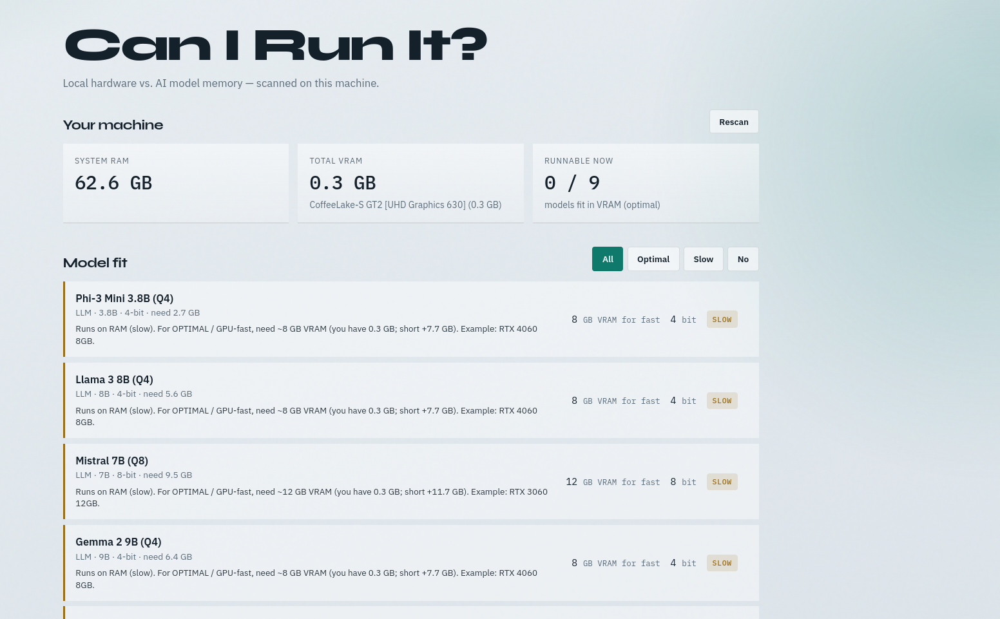

# Can I Run It?
[](https://github.com/aeliwat/Can-I-Run-It-/actions/workflows/blank.yml)

Check whether your machine can run local AI models.



It detects your **RAM** and **GPU VRAM**, then estimates memory needs for a catalog of models. Results show as:

| Status | Meaning |
|--------|---------|
| **OPTIMAL** | Fits in GPU VRAM |
| **SLOW** | Fits in system RAM (CPU / offload) |
| **INCOMPATIBLE** | Not enough RAM + VRAM |

Includes a terminal report, JSON output, and a local web UI.

---

## Features

- Auto-detects system RAM and GPUs (via [OSHI](https://github.com/oshi/oshi))
- Built-in model catalog (`models.json`)
- Add your own LLMs from the CLI or web UI
- Upgrade tips: VRAM shortfall + example GPUs to reach OPTIMAL
- Local-only web UI (nothing is sent to a server)
- Docker image + Compose for easy sharing
---

## Requirements

- **Docker** / **Docker Compose** (easiest), **or**
- **Java 17+** and **Maven 3.8+** (local run)

Optional: `nvidia-smi` (or NVIDIA Container Toolkit) for more accurate NVIDIA VRAM detection.

---

## Run with Docker (recommended)

### 1. Build

```bash
docker compose build
```

### 2. Start the web UI

```bash
docker compose up -d
```

Open: [http://127.0.0.1:7421](http://127.0.0.1:7421)

### 3. Stop

```bash
docker compose down
```

### CLI with Docker

```bash
# Terminal compatibility table
docker run --rm can-i-run-it:latest

# JSON output
docker run --rm can-i-run-it:latest --json

# Add a custom model (persists in the can-i-run-it-data volume)
docker run --rm \
  -v can-i-run-it-data:/root/.can-i-run-it \
  can-i-run-it:latest \
  --add-model --name "My LLM 13B (Q4)" --params 13 --bits 4 --buffer 1.5
```

Custom models from Compose persist in the Docker volume `can-i-run-it-data` (`/root/.can-i-run-it` in the container).

### Plain `docker` (no Compose)

```bash
docker build -t can-i-run-it .

docker run --rm -p 7421:7421 \
  -e CAN_I_RUN_IT_BIND=0.0.0.0 \
  -v can-i-run-it-data:/root/.can-i-run-it \
  -v /sys:/sys:ro \
  can-i-run-it --ui --no-browser --port 7421
```

### NVIDIA GPU tip

If you have the [NVIDIA Container Toolkit](https://docs.nvidia.com/datacenter/cloud-native/container-toolkit/latest/install-guide.html), uncomment the `deploy.resources` block in `docker-compose.yml`, then rebuild:

```bash
docker compose up -d --build
```

> **Note:** Inside Docker, RAM/GPU detection is best-effort. For the most accurate host scan, run the JAR directly on the machine.

---

## Run locally (Java)

```bash
mvn -DskipTests package

java -jar target/can-i-run-it-1.0.0-SNAPSHOT.jar
java -jar target/can-i-run-it-1.0.0-SNAPSHOT.jar --ui
java -jar target/can-i-run-it-1.0.0-SNAPSHOT.jar --json
```


---

## CLI reference

| Flag | Description |
|------|-------------|
| *(default)* | Print an ASCII compatibility table |
| `--json`, `-j` | Print JSON |
| `--ui`, `-u` | Start the local web UI |
| `--port`, `-p <n>` | UI port (default: `7421`) |
| `--bind <addr>` | UI bind address (default: `127.0.0.1`; Docker uses `0.0.0.0`) |
| `--no-browser` | Don’t open a browser with `--ui` |
| `--models`, `-m <file>` | Use a custom catalog file (skips built-in + custom merge) |
| `--add-model` | Add a custom model (needs `--name`, `--params`, `--bits`) |
| `--remove-model <name>` | Remove a custom model |
| `--help`, `-h` | Show help |

Env: `CAN_I_RUN_IT_BIND` overrides the default bind address.

### Add a custom model

```bash
java -jar target/can-i-run-it-1.0.0-SNAPSHOT.jar \
  --add-model \
  --name "My LLM 13B (Q4)" \
  --params 13 \
  --bits 4 \
  --buffer 1.5
```

Optional flags: `--buffer` (default `1.0`), `--category` (default `LLM`).

Custom models are stored at `~/.can-i-run-it/custom-models.json`.

---

## How estimates work

```text
Required_GB ≈ (params_B × quant_bits / 8) × 1.15 + context_buffer_GB
```

This is a **rule of thumb**, not a benchmark. Real usage depends on runtime, context length, batch size, and framework overhead.

For models that are not OPTIMAL, the tool suggests how much **VRAM** you need for GPU-fast results, plus an example GPU class.

Edit `src/main/resources/models.json`, or pass `--models`.

---
